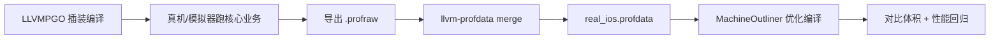

# iOS Machine Outliner + PGO 安装包优化指引

> 通过 LLVM PGO 收集 Kotlin/Native 运行时调用频次，再用 Machine Outliner 按热度做指令抽离，减小 `shared.framework` / IPA 体积。  
> 本指引已在本仓库 `demo` + `iosApp` 落地，可直接按下方脚本跑通。

:::warning 注意
Machine Outliner 会改变代码布局，**可能影响热路径性能**。上线前务必做体积对比与性能回归。插装包仅用于数据采集，不要发给用户。
:::

## 1. 原理与模式

| `LLVM_PGO_TYPE` | 模式 | 行为 |
|-----------------|------|------|
| `LLVMPGO` | PGO 插装 | Kotlin/Native 加 `-fprofile-instrument=llvm`，链接 `LLVMCompileRT`，运行生成 `.profraw` |
| `MachineOutliner` | PGO + Outliner | 若存在 `real_ios.profdata` 则做 PGO use；并启用 `-enable-machine-outliner=always` |
| 未设置 | 普通编译 | 不改 clang 参数，不链 profile runtime |



## 2. 工程落点（本仓库）

| 组件 | 路径 | 说明 |
|------|------|------|
| K/N 编译开关 | [`demo/build.gradle.kts`](../../demo/build.gradle.kts) | 读 `LLVM_PGO_TYPE`，覆盖 `clangOptFlags` / `clangDebugFlags` / `clangFlags`；插装侧带 `-mllvm -disable-vp` |
| Profile 数据 | [`demo/llvmProfile/`](../../demo/llvmProfile/) | `profraw/` 原始数据，`real_ios.profdata` 合并结果 |
| Profile Runtime Pod | [`iosApp/components/LLVMCompileRT/`](../../iosApp/components/LLVMCompileRT/) | 提供与 KN 同版本的 `libclang_rt.profile_ios.a` / `iossim`（iossim 为 arm64+x86_64 fat；由 setup 脚本从 LLVM16 compiler-rt 编译） |
| Pod 条件依赖 | [`iosApp/Podfile`](../../iosApp/Podfile) | 仅 `LLVMPGO` 时 `pod 'LLVMCompileRT'` |
| 运行时落盘 | [`iosApp/iosApp/iOSApp.swift`](../../iosApp/iosApp/iOSApp.swift) | 仅 `#if LLVM_PGO_INSTRUMENT`：设置 profile 路径，定时 / 进后台调用 `__llvm_profile_write_file` |
| 脚本 | [`iosApp/scripts/`](../../iosApp/scripts/) | 编译 runtime、插装构建、merge、优化构建 |

## 3. 一键脚本流程

在仓库根目录执行：

### 步骤 1：准备 profile runtime

```bash
bash iosApp/scripts/setup_llvm_compile_rt.sh
```

用 Kotlin/Native 自带的 LLVM16 clang，从 compiler-rt 16.0.0 源码编译完整的 `libclang_rt.profile_*.a` 到 `LLVMCompileRT`（**不要**直接拷 Xcode clang17 的 profile runtime，ABI / raw profile 版本不匹配）。`iossim` 会编 arm64 + x86_64 再用 `lipo` 合成 fat，以覆盖 `ios_simulator_arm64` / `ios_x64`。

### 步骤 2：打插装包

```bash
# 模拟器 Debug（便于采集）
bash iosApp/scripts/build_pgo_instrumented.sh --simulator

# 或真机
bash iosApp/scripts/build_pgo_instrumented.sh --device
```

脚本会：`LLVM_PGO_TYPE=LLVMPGO` → `pod install`（引入 LLVMCompileRT）→ `xcodebuild`，并传入 `SWIFT_ACTIVE_COMPILATION_CONDITIONS=LLVM_PGO_INSTRUMENT` 打开 App 侧落盘逻辑。普通包 / MachineOutliner 包**不要**传该宏，不会挂 3s 定时器。

### 步骤 3：运行并采集

1. 安装并启动 App，**尽量走完核心页面与高频交互**（路由、列表滚动、关键业务页）。
2. 切到后台或杀掉 App，触发 profile 落盘。
3. 日志中应出现：`[LLVM_PGO] LLVM_PROFILE_FILE=.../Documents/kuikly_%m.profraw`。

**模拟器导出：**

```bash
BUNDLE_ID=$(plutil -extract CFBundleIdentifier raw \
  "$(ls -td ~/Library/Developer/Xcode/DerivedData/iosApp-*/Build/Products/Debug-iphonesimulator/iosApp.app | head -1)/Info.plist")
SIM_ID="<你的模拟器 UDID>"
DATA_CONTAINER=$(xcrun simctl get_app_container "$SIM_ID" "$BUNDLE_ID" data)
mkdir -p demo/llvmProfile/profraw
cp "$DATA_CONTAINER"/Documents/*.profraw demo/llvmProfile/profraw/
```

**真机：** 通过 Xcode Devices 窗口下载 Container，或从 App 沙盒 `Documents` 拷出 `.profraw`。

### 步骤 4：合并 profdata

```bash
bash iosApp/scripts/merge_profraw.sh
# 或指定目录：
# bash iosApp/scripts/merge_profraw.sh /path/to/profraw_dir
```

产物：`demo/llvmProfile/real_ios.profdata`。

### 步骤 5：优化编译

```bash
bash iosApp/scripts/build_machine_outliner.sh --device
```

`LLVM_PGO_TYPE=MachineOutliner`，**不再**链接 LLVMCompileRT，按 profdata 做 PGO + Machine Outliner。

### 步骤 6：验证

```bash
# 对比 shared.framework 体积（路径随配置变化）
ls -lh demo/build/cocoapods/framework/shared.framework/shared
# 或对比最终 .app / IPA
```

- 记录优化前后二进制 size（**优先对比 `strip` 后的体积**；见 [§7.5](#75-体积对比与回归)）。
- 在真机做启动、滚动、动画等性能回归。
- 确认 Gradle 日志出现 `[LLVM_PGO] 使用 profdata: ...`（有 PGO use）或「仍启用 outlining（无 PGO use）」告警。

## 4. 编译参数说明

### 4.1 插装（`LLVMPGO`）

```text
-Os -ffunction-sections
-fprofile-instrument=llvm
-fprofile-instrument-path=/fake/default_ios.profraw
-mllvm -disable-vp
```

运行时由 `LLVM_PROFILE_FILE` 覆盖输出路径。`-disable-vp` 关闭 Value Profiling（见 [§7](#7-常见问题)）；**不要**写 `-enable-value-profiling=false`，在 LLVM16 上会被静默忽略。

### 4.2 优化（`MachineOutliner`）

```text
-Os -ffunction-sections
-fprofile-instrument-use-path=<repo>/demo/llvmProfile/real_ios.profdata   # 若文件存在
-mllvm -enable-machine-outliner=always
```

同时覆盖 `clangFlags.ios_*` 为 `-cc1 -emit-obj -x ir`（去掉 Debug 默认的 `-disable-llvm-passes`，否则插装 / PGO use / Outliner 相关 LLVM pass 不会执行）。若 `real_ios.profdata` 不存在，Gradle 会告警并**仍启用 outlining（无 PGO use）**。

Debug / Release 分别走 Konan 的 `clangDebugFlags` / `clangOptFlags`，本仓库对 `ios_arm64` / `ios_x64` / `ios_simulator_arm64` 均已覆盖。

> 注：部分内部 LLVM / KN 分支还支持 `machine-outliner-block-count-threshold`、`hot-callsite-threshold`、`mergeFunctions` 等扩展；开源 KN（LLVM16）会报 `Unknown command line argument` / `Unknown binary option`，本仓库**不默认启用**。

## 5. 手动命令（不走脚本时）

```bash
# 插装
export LLVM_PGO_TYPE=LLVMPGO
bash ./gradlew :demo:generateDummyFramework
cd iosApp && pod install
# 再按需 xcodebuild ...

# 优化
export LLVM_PGO_TYPE=MachineOutliner
# 确保 demo/llvmProfile/real_ios.profdata 已存在
bash ./gradlew :demo:syncFramework \
  -Pkotlin.native.cocoapods.platform=iphoneos \
  -Pkotlin.native.cocoapods.archs=arm64 \
  -Pkotlin.native.cocoapods.configuration=Release
```

> `pod install` **必须**在对应 `LLVM_PGO_TYPE` 下执行：Podfile 在 install 时根据环境变量决定是否引入 `LLVMCompileRT`。

## 6. 业务工程接入建议

1. 在业务 KMP 模块的 `build.gradle.kts` 复用本仓库 `demo` 中的 `LLVM_PGO_TYPE` 分支逻辑。
2. 宿主 iOS 工程增加 `LLVMCompileRT` 私有 pod（或同等链接 `libclang_rt.profile_*.a`）。
3. 在 App 启动最早阶段设置 `LLVM_PROFILE_FILE`，退出/进后台写 profile。
4. 用**接近线上的核心路径**采集；profile 过旧或覆盖不足会误导 inline / outliner。
5. 优化包与插装包使用同一 Kotlin/Native 大版本；merge 时优先用 `~/.konan/dependencies` 下与 KN 匹配的 `llvm-profdata`。

## 7. 常见问题

> 以下条目来自本仓库在模拟器上打通「插装 → dump → merge → MachineOutliner」时踩过的坑。核心原则：**插装侧（KN LLVM16）↔ profile runtime ↔ `llvm-profdata` 三者必须同版本、同 ABI。**

### 7.1 Profile Runtime / 链接

| 现象 | 原因与处理 |
|------|------------|
| 链接失败：`___llvm_profile_*` undefined | 未在 `LLVM_PGO_TYPE=LLVMPGO` 下 `pod install`，或未跑 `setup_llvm_compile_rt.sh` |
| 大量其它符号 undefined（像 CocoaPods 链接参数被冲掉） | `LLVMCompileRT` podspec 的 `OTHER_LDFLAGS` **必须含 `$(inherited)`**，否则会覆盖宿主已有 linker flags |
| 找不到 `libclang_rt.profile_*.a` | path pod **不会**拷贝到 `Pods/LLVMCompileRT`；链接路径用 `$(SRCROOT)/components/LLVMCompileRT/...`，不要写 `$(PODS_ROOT)/LLVMCompileRT/...` |
| 运行崩溃在 `__llvm_profile_instrument_target` | 用了 **Xcode clang17** 的 `libclang_rt.profile_*.a`，与 KN **LLVM16** 插装的 value-profiling ABI 不匹配。必须用本仓库 setup 脚本从 **compiler-rt 16.0.0** 编出的完整 runtime |
| 链接缺 `_lprofGetVPDataReader` / `_lprofSetupValueProfiler` 等 | 曾为避崩把 `InstrProfilingValue.o` 从 `.a` 里删掉 / stub。即便插装侧已 `-disable-vp`，runtime 仍需保留该目标文件以解析上述符号 |
| 链接缺 `_lprofGetHostName` | 手动编 compiler-rt 时未定义 `COMPILER_RT_HAS_UNAME`（以及 Darwin 上常用的 `COMPILER_RT_HAS_FCNTL_LCK` / `ATOMICS`）。setup 脚本已补齐 |
| Intel 模拟器链接 `symbol(s) not found for architecture x86_64` | 旧版 runtime 只有 arm64 slice。setup 脚本已对 `libclang_rt.profile_iossim.a` 做 arm64+x86_64 `lipo`；请重跑 `setup_llvm_compile_rt.sh` |

### 7.2 Value Profiling（VP）与 `truncated profile data`

**VP（Value Profiling）**：除函数/基本块执行次数外，额外记录「间接调用实际跳到谁」「memop 常见长度」等动态值。会生成 `__llvm_prf_vals` / `__llvm_prf_vnds`，并在 `__llvm_prf_data` 里留下 `NumValueSites`。

| 现象 | 原因与处理 |
|------|------------|
| `llvm-profdata merge` 报 `truncated profile data` | **写出文件自相矛盾**：data 记录里 `NumValueSites > 0`，但 `.profraw` 只有 header+data+counters+names、**没有 VP payload**。常见根因是插装侧 VP 没真正关掉 |
| 写了 `-mllvm -enable-value-profiling=false` 仍有 `__llvm_prf_vals` | 该 flag 名在 **LLVM16 上无效，会被静默忽略**。正确开关是 **`-mllvm -disable-vp`**（本仓库 `demo/build.gradle.kts` 已使用） |
| 如何确认 VP 已关闭 | 对插装后的 `shared` 跑 `otool -l … \| rg '__llvm_prf'`：应只剩 `__llvm_prf_cnts` / `__llvm_prf_data` / `__llvm_prf_names`，**不应**再有 `vals` / `vnds` |

Machine Outliner 主要依赖「热/冷」计数；关掉 VP 不影响本指引主路径，还能让 dump / merge 稳定。

### 7.3 Dump / Merge 工具

| 现象 | 原因与处理 |
|------|------------|
| 没有 `.profraw` | 未链上 LLVM16 profile runtime；或进程被强杀未走落盘逻辑；看日志里 `[LLVM_PGO]` 的路径与 `write_file` 返回值 |
| `.profraw` 体积成倍变大 | App 内定时 dump 可能对同一路径 **多次 append**；`llvm-profdata merge` 能吃拼接 raw，但导出前可先清 Documents 或只保留一份 |
| Xcode 的 `llvm-profdata` 报 raw version mismatch（如 v8 vs v10） | KN 插装产出 **raw format version 8**；Xcode 17 工具期望更新版本。**必须用** `~/.konan/dependencies/llvm-16.0.0-*-macos-*/bin/llvm-profdata`（`merge_profraw.sh` 优先 glob 匹配；命中非 16 会 warn） |
| 用本机新版 clang 随便生成一份 seed `.profdata` 给 KN | format / 版本不兼容，PGO use 无效或报错。应用本仓库插装包真实跑出来的 profile 再 merge |
| 正式包里每 3s 打 `[LLVM_PGO]` 日志 / 空转定时器 | 落盘逻辑已用 `#if LLVM_PGO_INSTRUMENT` 包起来；只有 `build_pgo_instrumented.sh` 会传该编译条件。普通 / MachineOutliner 包不要手动加该宏 |

### 7.4 Kotlin/Native / Gradle 编译

| 现象 | 原因与处理 |
|------|------------|
| framework 无 `__llvm_prf_*` section | Debug 未覆盖 `clangFlags`，仍带 `-disable-llvm-passes`，插装 pass 未执行。确认 Gradle 有 `[LLVM_PGO]` 日志，必要时 `--rerun-tasks` |
| `Unknown command line argument: -machine-outliner-block-count-threshold=...`（或同类 threshold） | 多为**内部 LLVM 扩展**；开源 KN/LLVM16 只稳定支持 `-enable-machine-outliner=always`。本仓库已去掉内部 threshold |
| `Unknown binary option 'mergeFunctions'` | 开源 KN 2.1.21 不支持；不要加 `-Xbinary=mergeFunctions=true` |
| Release MachineOutliner 链接 `Java heap space` | Outliner + 大 bitcode 极吃内存。提高 Gradle / Kotlin daemon 堆（实践约 `-Xmx10g`），构建前 `./gradlew --stop` |
| `real_ios.profdata` 缺失时以为「没开 Outliner」 | 当前逻辑是：缺 profdata 时 **仍启用 outlining（无 PGO use）**，并打 warn。看日志区分「无 PGO」与「有 PGO use」 |

### 7.5 体积对比与回归

| 现象 | 原因与处理 |
|------|------------|
| unstripped 变大、以为优化失败 | Outliner 后符号/调试信息可能变多。**以 `strip` 后的二进制为准**再对比 |
| 「体积完全没变」 | 先确认链接是否成功；失败时拷贝的可能仍是 baseline。核对 `BUILD SUCCESSFUL` 与二进制 md5 / mtime |
| 有 PGO use 后 stripped 收益略小于裸 `always` | 符合预期：profile 让 outliner 对热路径更保守，用一点体积换性能安全 |
| 性能回退明显 | 优先保证走完整 PGO use（不要长期裸 `always`）；必要时去掉 `enable-machine-outliner=always` 只保留 PGO use；上线前做启动 / 滚动 / 动画回归 |
| Bundle ID / 安装错包 | 工程里 Bundle ID 可能被改过（如 `...luoyibu` / `...db`）。安装前用 `plutil` 读实际 `CFBundleIdentifier`，不要写死 |

### 7.6 模式混用

| 现象 | 原因与处理 |
|------|------------|
| 优化包仍链着 LLVMCompileRT | `pod install` **必须**在对应 `LLVM_PGO_TYPE` 下执行；MachineOutliner / 普通包不应引入该 pod |
| 插装包与优化包 LLVM 大版本不一致 | profile 与 PGO use 可能对不上。插装、merge、优化使用同一套 KN / LLVM16 工具链 |

## 8. 与其它安装包优化的关系

本能力与 [Kuikly安装包优化指引](./kuikly-perf-guidelines.md) 中的 `-Os` / `function-sections` / 符号 internal 化等正交，可叠加。裸开 Machine Outliner（无 PGO）对冷路径更激进，**更建议本指引的「先 PGO 再 Outliner」**，用频次保护热路径。
