# KMP跨端工程接入

:::tip 建议
如果您还没阅读过Kuikly接入概述，建议您先移步[Kuikly概述](overview.md). 了解下接入Kuikly涉及到的工作
:::

为了减少业务开发者接入的成本，我们基于Android Studio开发了Kuikly脚手架插件, 你可以通过Kuikly脚手架插件轻松创建带有``Kuikly``的KMP工程。这个工程也是平时你写业务代码的工程

## 新建Kuikly工程

:::tip 注意
在此之前请确保已经完成**Kuikly**环境搭建，如还未搭建环境，请移步[环境搭建文档](env-setup.md)
:::

1. 使用``Android Studio``新建``Kuikly``工程。 **File -> New -> New Project -> Kuikly Project Template**

:::tip 提示
* 新建工程后，可检查以下配置文件，把``Kuikly``的版本号替换为最新版本
  * 业务逻辑模块：``shared/build.gradle.kts``
  * Android壳工程：``androidApp/build.gradle.kts``
  * iOS壳工程：``iosApp/Podfile``
  * 鸿蒙壳工程：``ohosApp/entry/oh-package.json5``
* 在这里[查看最新版本](../ChangeLog/changelog.md)
* 各端的版本号需要保持一致
:::

## 按需创建额外的模块

新建后，工程结构如图所示

除了在shared中开发页面外，可以按需增加新的模块

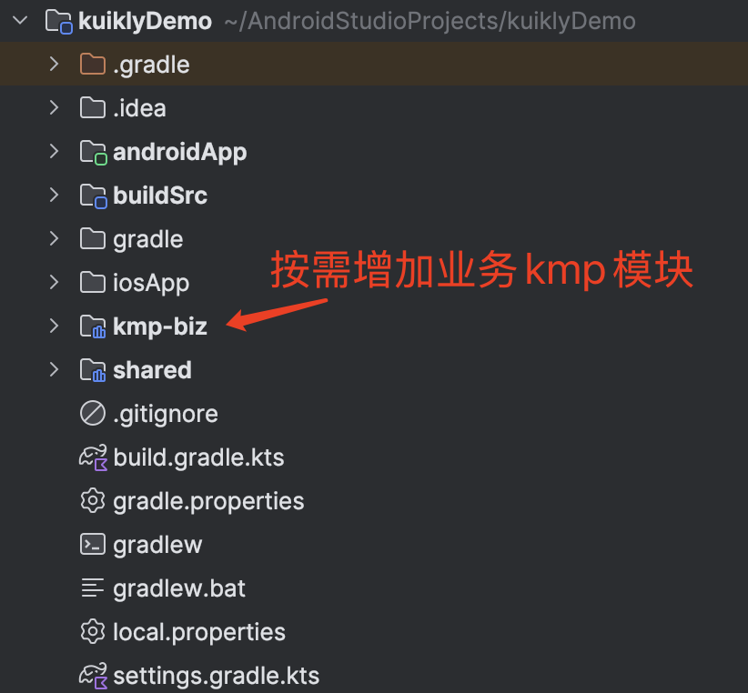

## 运行androidApp

1. 接着运行``androidApp``

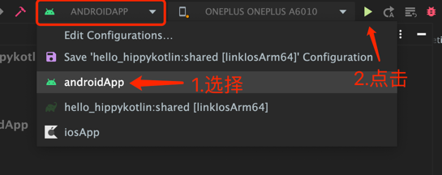

2. 当手机出现**以下页面**时，说明已经成功运行``androidApp``

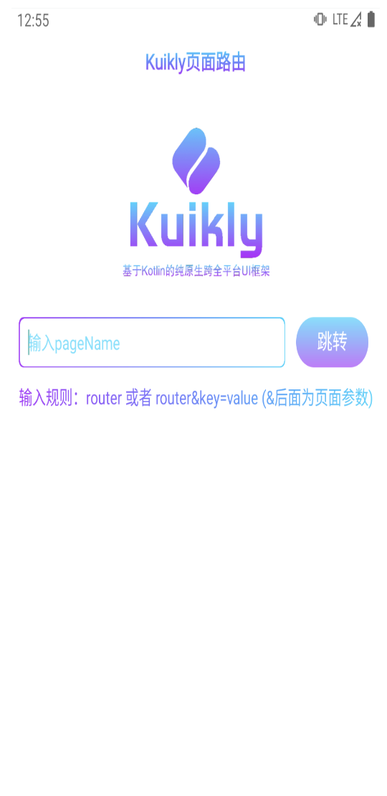

## 运行iosApp

1. 如果是首次运行iOS的话，需要先进入iosApp目录，执行`pod install --repo-update`。
2. 将运行的scheme改为iosApp

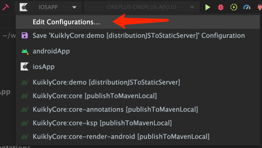
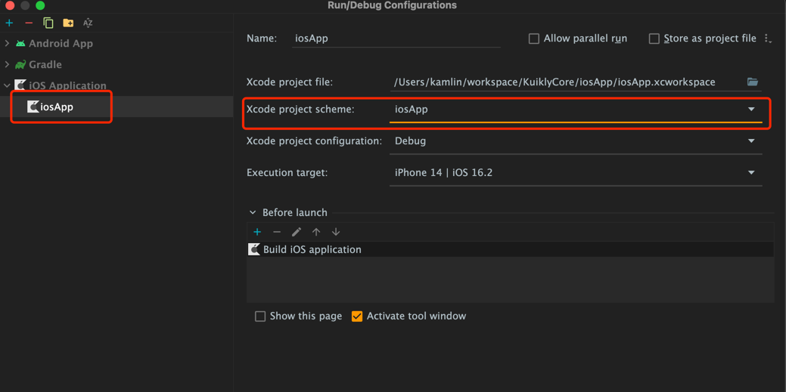

3. 运行``iosApp``

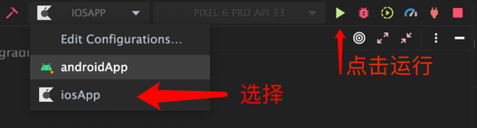

4. 当手机出现下面界面时，说明已运行成功

## 运行鸿蒙App
1. 如果是首次运行Ohos的话，需要用鸿蒙DevEco-Studio打开ohosApp目录
   >若初次打开鸿蒙IDEsync出错，打开ohosApp目录下的.npmrc文件，右上角点击sync重新sync即可
2. 在运行App之前，需要执行签名操作
   File -> Project Structure -> Signing Configs
    

        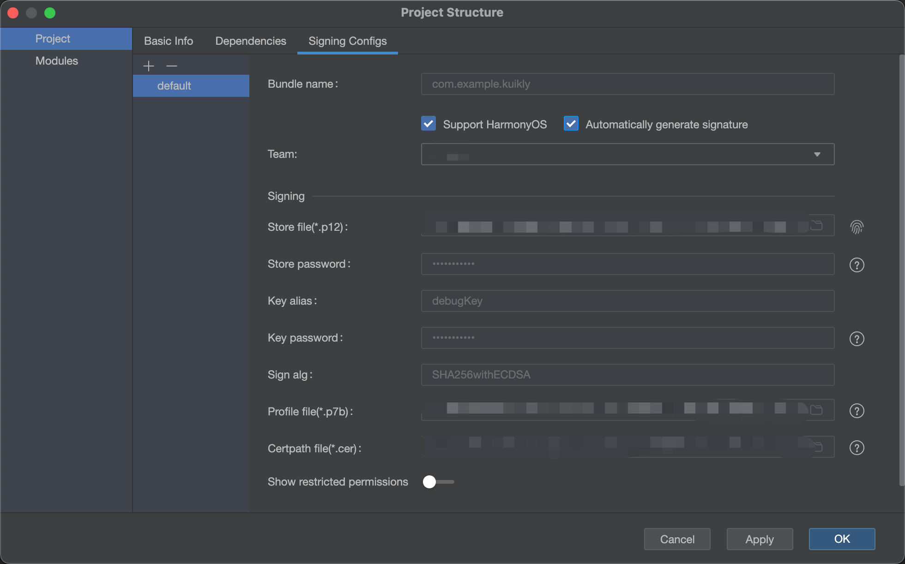
    

3. 运行``ohosApp``

   可以选择在 DevEco-Studio 内运行 或 Android Studio 内运行

   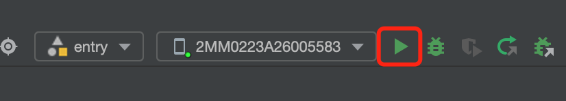

   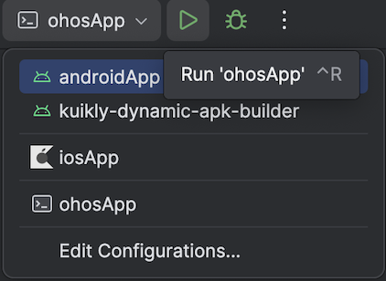
   > 若 Android Studio 无ohosApp选项 重新打开Android Studio即可
4. 当手机出现下面界面时，说明已运行成功ohosApp
    

        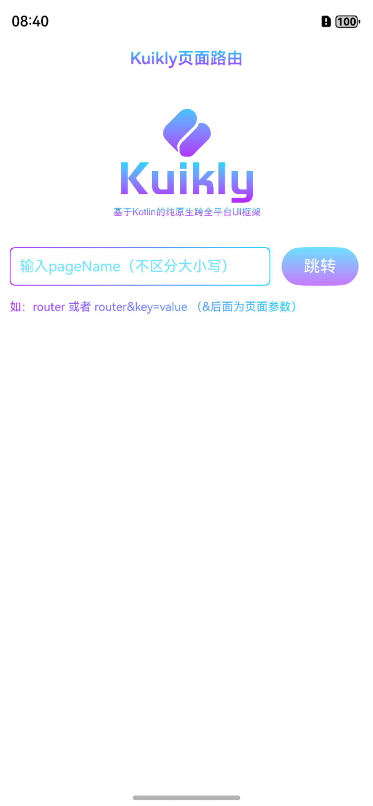
    

## 下一步

在成功运行androidApp和iosApp后我们就已经完成Kuikly KMP工程的新建。下一步，我们还需要在各个平台接入Kuikly的渲染器和设置一些适配器的工作。 以下是各个平台Kuikly渲染器的接入文档:

1. [Android KuiklyRender接入](android.md)
2. [iOS KuiklyRender接入](iOS.md)
2. [鸿蒙 KuiklyRender接入](harmony.md)

## 可能会遇到的问题

### :shared:podInstall错误

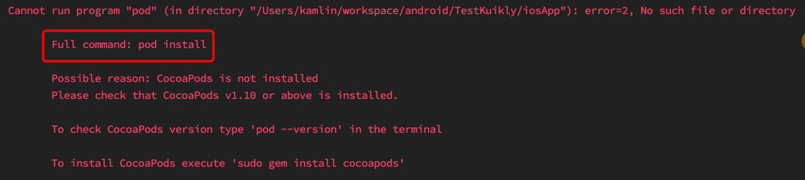

Android Studio本身的bug，可以查看[StackOverflow的解决方案](https://stackoverflow.com/questions/67813636/execution-failed-for-task-sharedpodinstall)

### Android Studio版本过低

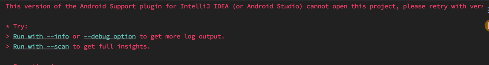

Android Studio版本过低，可下载最新的Android Studio版本
